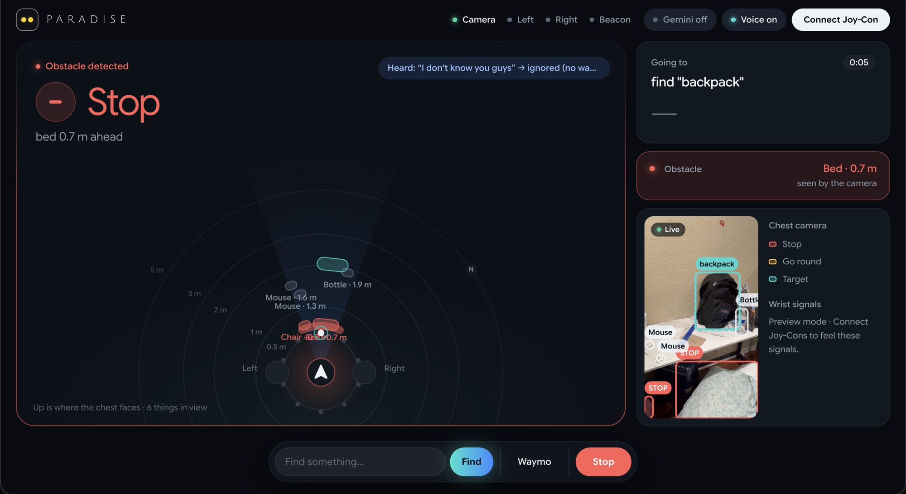

# Paradise

**Touch-only navigation for people who are DeafBlind.**
🏆 3rd Place Overall at ShellHacks 2026 (1,400+ hackers).
Built by Akhilesh Reddy Mallu, Haren Gannarapu, Pranavsai Gandikota and Devam Dholakia.

<a href="https://www.youtube.com/watch?v=BVIRTrum1OM">
  
</a>

▶️ **[Watch the demo](https://www.youtube.com/watch?v=BVIRTrum1OM)**

Most accessibility tech assumes you can either see or hear. Tools for blind people talk to you;
Tools for Deaf people show you something. For someone who is DeafBlind, both channels are closed.
Paradise gives directions through touch alone.

A phone on the wearer's chest is the eyes. A laptop in a backpack does the thinking. Two Nintendo
Joy-Cons, one strapped to each wrist, give the directions:

| Feel | Means |
|---|---|
| Left wrist buzzing | Turn left |
| Right wrist buzzing | Turn right |
| Both wrists buzzing | Walk forward |
| A double buzz on both | You've arrived |
| Nothing | Don't walk |

The direction *is* the signal: the left wrist means left. There's nothing to translate, and
nothing to look at or listen to.

Paradise does three things:

1. **Walks you to a saved place** along real sidewalks and footpaths, using an OpenStreetMap walking
   route, GPS, and the phone's compass.
2. **Walks you to a waiting car.** It follows GPS toward the car's location, then switches to the
   camera for the last few meters to the car itself.
3. **Finds an everyday object and walks you to it** ("water bottle", "chair", "laptop"). If it isn't
   in view, the wrists turn you around the room until the camera spots it.

Along the way, it stops you before things right in front of you and steers you around things
further ahead.



*The laptop dashboard, for onlookers, while finding a backpack. The chest camera (right) has the
backpack as the target (teal) and a bed 0.7 m ahead as an obstacle (red), so the wearer is told to
stop. The top-down scene (center) shows everything the camera sees around the wearer.*

> **Safety.** This is a supervised prototype. It works *alongside* a white cane, never instead of
> one. It misses low curbs, steps down, holes, and glass, and its distances are rough. Always test with
> a sighted spotter walking next to the wearer.

```
git clone https://github.com/Akhileshreddym/Paradise.git
cd Paradise/paradise
npm install
npm start
```

Full setup is in [Getting started](#4-getting-started).

---

## Contents

1. [How it works](#1-how-it-works)
2. [Results](#2-results)
3. [What you need](#3-what-you-need)
4. [Getting started](#4-getting-started)
5. [Test it, step by step](#5-test-it-step-by-step)
6. [Using it](#6-using-it)
7. [How it works, in depth](#7-how-it-works-in-depth)
8. [Tuning and customizing](#8-tuning-and-customizing)
9. [The Waymo classifier](#9-the-waymo-classifier)
10. [Built, but switched off](#10-built-but-switched-off)
11. [Troubleshooting](#11-troubleshooting)
12. [Known limitations](#12-known-limitations)
13. [Privacy and security](#13-privacy-and-security)
14. [Why it's built this way](#14-why-its-built-this-way)
15. [Files](#15-files)
16. [Credits and licenses](#16-credits-and-licenses)
17. [License](#17-license)

---

## 1. How it works

```
 ┌──────────── chest iPhone (Safari) ────────────┐        ┌──── beacon phone ────┐
 │ eyes.html                                      │        │ beacon.html          │
 │  camera → YOLOv10s (in the browser, WebGPU)    │        │  GPS, once a second  │
 │  compass, tilt, GPS, speech → text             │        │  (stands in for the  │
 │  live video → the laptop (WebRTC)              │        │   car's location)    │
 └───────────────────────┬────────────────────────┘        └──────────┬───────────┘
                         │  https + WebSocket, through a Cloudflare tunnel │
                         ▼                                                 ▼
 ┌─────────────────────────────── Mac, in a backpack ──────────────────────────────────┐
 │ npm start → server.js: serves the pages, relays messages, runs the models            │
 │   ├─ detector-worker.js   (own process): YOLOv8n, finds the object you asked for     │
 │   ├─ depth-worker.js      (own process): Depth Anything V2 + floor fit → obstacles   │
 │   ├─ clip-worker.js       (own process): CLIP + trained head, "is this a Waymo?"     │
 │   └─ ai.js / tts.js       (optional): Gemini, ElevenLabs                             │
 │ Chrome → http://localhost:8080/ → hands.html: every guidance decision + the display  │
 └───────────────────────────────────────┬──────────────────────────────────────────────┘
                                         │ Bluetooth (Chrome's WebHID)
                       Joy-Con (L) on the left wrist · Joy-Con (R) on the right wrist
```

**The guidance controller lives in `hands.html`**, in the laptop's browser. It runs every 50 ms
(20 times a second). Each time, it combines the compass heading, GPS, the walking route, what the
cameras see, and the obstacle estimates, and decides which wrist to buzz. The server relays messages
and runs the models; Gemini never steers.

| Part | Runs on | Job |
|---|---|---|
| YOLOv10s (80 everyday object types) | Chest iPhone, web worker (WebGPU, WebAssembly fallback) | People, cars, chairs… several times a second: obstacles, cars to check, each car's colour |
| Compass, tilt, GPS, speech-to-text | Chest iPhone | Which way the wearer faces, how far the camera looks down, where they are, what they said |
| Live video | Chest iPhone → laptop, WebRTC (H.264) | The camera feed for the display, the detector and the depth model; small JPEG frames through the server as a fallback |
| Beacon | Second phone | Shares "the car's" location (there's no public Waymo API) |
| `server.js` | Mac, Node.js | Serves the pages, relays messages by allowlist, hands frames to the models |
| YOLOv8n | Mac, own process | Find mode and the last meters to the car: frames from the live video, as fast as they're answered |
| Depth Anything V2 Small (8-bit) | Mac, own process | A depth estimate for every pixel, turned into obstacles in the walking path, including things YOLO has no name for (walls, poles, boxes) |
| CLIP ViT-B/32 (8-bit) + trained head | Mac, own process | Scores each car crop: is it a Waymo? |
| Gemini (optional) | Google's API, called by the server | Reads voice commands, turns vague requests into an object ("something to drink" → water bottle), and checks arrival from a photo |
| ElevenLabs (optional) | ElevenLabs' API, called by the server | Speaks short status sentences for onlookers; the browser's own voice is the fallback |
| `hands.html` | Mac, Chrome | Every guidance decision, driving the Joy-Cons, the display |

---

## 2. Results

Measured on a MacBook Pro (M3 Pro), laptop CPU only, with the models warmed up. The latency
benchmark forked the project's real worker processes and sent each 200 frames made from the
training photos, at the sizes the app sends. Each time covers the full round trip: send the frame,
decode the JPEG, preprocess, run the model, postprocess, and get the result back.

| What | Median | 95th percentile |
|---|---|---|
| YOLOv8n detection, 640 px frame, running alone | **31.5 ms** (~32 fps) | 35 ms |
| YOLOv8n detection, with depth and CLIP running at the same time | **70 ms** | 158 ms |
| Depth model + floor fit, 360 px frame, alone / with the others running | 88 ms / 113 ms | 154 ms / 251 ms |
| CLIP + Waymo classifier, 224 px crop, alone | 11.6 ms | 17 ms |

**Waymo classifier**, over 50 repeats of 5-fold cross-validation, grouped by source photo
(125 Waymo crops, 654 other vehicles):

| Cutoff | Recall | Precision | False-positive rate |
|---|---|---|---|
| 0.5 | 96.5% ± 0.7 | 76.0% ± 1.2 | 5.8% |
| **0.9** (used) | **89.0% ± 1.3** | **96.0% ± 0.7** | **0.7%** (~4.7 of 654) |
| 0.95 | 83.7% ± 1.4 | 97.0% ± 0.9 | 0.5% |

ROC-AUC: **0.992 ± 0.002**.

These numbers measure the models, not the whole system. There's no measurement yet of end-to-end
latency from the camera to the wrist, of the phone's YOLOv10s speed, or of task success with real
users. The classifier results come from web photos and may be optimistic for real street
conditions.

---

## 3. What you need

### Hardware

| Item | Notes |
|---|---|
| Mac laptop with Bluetooth | Runs the server, the models and Chrome. Tested on a MacBook Pro (M3 Pro). ~400 MB of disk for the models. It travels with the wearer in a backpack, because the Joy-Cons connect to it over Bluetooth (~10 m range). Windows and Linux should also work, but only macOS was tested. |
| Nintendo Switch Joy-Con **(L)** and **(R)** | **Original Switch Joy-Cons** (USB product IDs `0x2006` and `0x2007`). Switch 2 Joy-Cons are **not** supported. Charge them fully. |
| 2 wrist straps | Any strap that holds a Joy-Con flat against the inside of the wrist. |
| Chest iPhone | Rear camera, GPS, compass, microphone. iOS 16.4 or newer. Uses WebGPU where Safari has it, otherwise WebAssembly. Android Chrome should also work but wasn't tested. |
| Chest mount or harness | Holds the phone **upright (portrait), rear camera facing forward**, centered on the chest, tilted down 10–20° so the floor ahead is in view. |
| Beacon phone | Any phone with GPS and a browser. It plays the car. |
| Internet for all three | The phone loads its model and runtime from CDNs; the laptop page loads the Joy-Con library; the tunnel runs through Cloudflare. Outdoors, an iPhone hotspot for the Mac works well. |
| Optional | A power bank for the chest phone, and a second person as a spotter. |

### Software

| Software | Version tested | Where | Notes |
|---|---|---|---|
| Node.js | 24.13.0 | Mac | Needs 22.9 or newer (`--env-file-if-exists`). |
| npm packages | `ws` 8.21.3; `@huggingface/transformers` 3.8.1 (brings `onnxruntime-node` 1.21.0 and `sharp` 0.34.5) | Mac | Installed by `npm install`. |
| Google Chrome or Edge | Current | Mac | Needed for WebHID (the Joy-Cons). Safari and Firefox can't. |
| cloudflared | 2026.9.3 | Mac | The https tunnel: `brew install cloudflared`. |
| Safari | Current iOS | Phones | Nothing to install. |
| Loaded by the pages | `joy-con-webhid` 0.11.0 (laptop); `onnxruntime-web` 1.22.0 and YOLOv10s (phone) | jsDelivr, Hugging Face | Cached by the browser after the first load. |
| Downloaded on first `npm start` | YOLOv8n (12 MB), Depth Anything V2 Small 8-bit (27 MB), CLIP ViT-B/32 8-bit (~155 MB), Grounding DINO tiny 8-bit (204 MB) | Mac, into `paradise/models/` | ~400 MB once, then loaded from disk. |

No accounts or paid services are required. Two parts are optional and need API keys: **Gemini**
(voice commands in plain words, vague requests, arrival checks) and **ElevenLabs** (a natural voice
for onlookers). Without them, voice commands use a built-in grammar, arrival is judged by the
camera alone, and the laptop speaks with the browser's voice.

---

## 4. Getting started

Run every command from the `paradise/` folder.

### 4.1 Install

```
cd paradise
npm install
```

### 4.2 Optional: API keys

Create `paradise/.env`:

```
GEMINI_API_KEY=your-key-here          # https://aistudio.google.com/apikey
ELEVENLABS_API_KEY=your-key-here      # https://elevenlabs.io
PARADISE_TOKEN=pick-a-key             # optional: keeps the same phone links across restarts
```

- Optional in the same file: `GEMINI_MODEL` (default `gemini-3.5-flash-lite`),
  `ELEVENLABS_VOICE_ID`, `ELEVENLABS_MODEL`, `PORT` (default 8080).
- `.env` is git-ignored, and only the server reads it. Never put a key in `public/`: those files are
  served to anyone with the tunnel address.

### 4.3 Start the server

```
npm start
```

```
ai (arrival checks, commands): ready (gemini-3.5-flash-lite)
tts (speech for onlookers): ready (eleven_flash_v2_5)
Laptop (hands): http://localhost:8080/
Phone (eyes):   https://<tunnel address>/eyes?k=h7mqx2ta
Beacon:         https://<tunnel address>/beacon?k=h7mqx2ta
detector: ready
depth: ready
clip (waymo classifier, second opinions): ready
object finder: ready
```

The first start downloads ~400 MB of models; after that, each start takes a few seconds. The
`k=…` in the phone links is the **link key**. It's new on every start unless `PARADISE_TOKEN` is set.
Leave this terminal running.

### 4.4 Pair the Joy-Cons (once)

1. Quit Steam, BetterJoy, and any other controller tool: they grab the Joy-Cons.
2. Open **System Settings → Bluetooth**.
3. Hold the small round **sync button** on the left Joy-Con's rail until the lights run back and
   forth, then click **Connect** next to **Joy-Con (L)**.
4. Repeat for **Joy-Con (R)**.

### 4.5 Open the laptop page

1. In **Chrome**, open <http://localhost:8080/>.
2. Click **Connect Joy-Con** and pick **Joy-Con (L)**, then again for **Joy-Con (R)**. Both pills at
   the top turn green.
3. Open **Testing** and play the buzzes to check each wrist.

Chrome remembers the permission, so the Joy-Cons reconnect by themselves next time. Strap
**(L) on the left wrist and (R) on the right**: swapping them swaps the steering.

### 4.6 Start the tunnel

iPhones only allow the camera, GPS, compass, and microphone on **https** pages. In a second
terminal:

```
cloudflared tunnel --protocol http2 --url http://localhost:8080
```

It prints an address like `https://words-words-words.trycloudflare.com`. The phone links are that
address plus the path and key `npm start` printed: `…/eyes?k=<key>` for the chest phone and
`…/beacon?k=<key>` for the beacon.

- `--protocol http2` matters: many venue and campus networks block the default (QUIC), and
  cloudflared then retries forever with `Failed to dial a quic connection`.
- The address changes whenever the tunnel restarts. The key changes whenever `npm start` restarts.
  Either way, reopen both phone links.
- If the Mac changes networks, the tunnel can keep running but stop passing traffic (Cloudflare
  error 530). Restart it.

### 4.7 Set up the chest iPhone

Once, in iPhone **Settings → Privacy & Security → Location Services**: turn it on, set **Safari
Websites** to *While Using the App*, and turn on **Precise Location**.

Then each time:

1. In Safari, open the chest phone link (`https://<tunnel>/eyes?k=<key>`). Allow the camera and
   location. The first load downloads ~30 MB.
2. **Tap anywhere once** to allow the compass and the microphone (iPhones only allow those after a
   tap).
3. Wait until every setup step is green: **Laptop**, **Camera**, **Object detection**,
   **Location**, **Compass & voice**.
4. Mount it: portrait, rear camera forward, tilted **10–20° down**. The page shows its tilt.
5. Under **Calibration**, set **Chest height (m)**: the camera's height above the floor
   (default 1.30).

### 4.8 Calibrate distances (once per phone)

Distances come from how big things look, which depends on the camera's focal length in pixels
(default 720). Have someone stand **exactly 3.00 m** away, whole body in view, enter their height in
**Person height (m)**, and tap **Calibrate at 3.00 m**.

### 4.9 Set up the beacon phone

Open the beacon link (`https://<tunnel>/beacon?k=<key>`), tap **Start sharing location**, and place
the phone in or on the car. Wait until accuracy is **±10 m** or better.

### 4.10 Add your own places

In `paradise/public/hands.html`, near the top of the script:

```js
const PLACES = [
  { name: "entrance", lat: 25.756123, lon: -80.373456 },   // a real spot (right-click in Google Maps to copy)
  { name: "test north", north: 30 },                       // 30 m north of wherever the wearer stands when chosen
];
```

The order sets the button count: 1 press is always the car, the first place is 2 presses, the
second is 3, and so on. The names are what the wearer says, so keep them short and distinct. Reload
the laptop page after editing.

### 4.11 Set your magnetic declination

GPS bearings use true north; the iPhone compass uses magnetic north. Set the difference for your
location in `hands.html` (east positive, west negative; look yours up with
[NOAA's calculator](https://www.ngdc.noaa.gov/geomag/calculators/magcalc.shtml)):

```js
const DECLINATION = -6.8; // Miami: about 6.8° west
```

### 4.12 Before every demo

- [ ] `npm start` shows every **ready** line.
- [ ] Tunnel running with `--protocol http2`; phone pages opened with today's address and this run's key.
- [ ] Laptop page: both Joy-Con pills green; each wrist buzzes under **Testing**.
- [ ] Chest phone: every setup step green; mounted upright, tilted 10–20° down; chest height and focal set.
- [ ] Laptop **Details**: `video: live (WebRTC …)`, and `depth: clear (floor NN%)` with a clear path ahead.
- [ ] Laptop **Details**: `heading` goes **up** when the wearer turns right.
- [ ] Beacon: ±10 m or better, in or on the car, screen on.
- [ ] Audience voice: click the laptop page once (Chrome plays no sound before a click).
- [ ] Spotter ready. Cane in hand.

---

## 5. Test it, step by step

Each step adds one piece. ✅ shows what working looks like. The quoted messages are the laptop
page's **Details → guide:** line.

1. **Laptop and Joy-Cons.** Play every buzz under **Testing**. ✅ Rotate left is felt on the left
   wrist, rotate right on the right, forward and back on both. Adjust **Settings → Buzz
   strength** until each is clearly felt through a sleeve.
2. **Choosing with the buttons.** Press once and wait 1.5 s. ✅ **Mode** says `Waymo`. Press three
   times. ✅ **Mode** says `test east`. There's no buzz to confirm a choice ([10](#10-built-but-switched-off)).
3. **Chest phone and compass** (indoors is fine). Open the chest phone page, tap once, and mount it.
   Choose **Testing → 90° right**. ✅ The right wrist buzzes until you've turned about 90°, then
   both buzz. Close the phone page. ✅ Within a second, `NO SIGNAL from the chest phone` and the
   wrists go quiet.
4. **Obstacles.** Choose anything and have someone step in front of you, under 0.8 m away.
   ✅ `STOP: person 0.7 m ahead`, a red STOP box, and the wrists go quiet. Walk toward a big box or a
   pillar from 3 m. ✅ Around 2.5 m, `GO AROUND: bear left 23° (an obstacle ahead)`, then
   `GO AROUND: walk past an obstacle`, then back toward the target.
5. **Voice.** Say "Paradise, take me to test north", then "Paradise, find the water bottle".
   ✅ The display shows `Heard: "…" → test north`, then `→ find "water bottle"`, and the speakers say
   *Going to test north.* Say "find the water bottle" without the wake word. ✅ `→ ignored (no wake
   word)`. Say "Paradise, stop". ✅ **Mode** goes `Off` at once.
6. **Find an object** (indoors). Put a bottle on a table 3–5 m away, out of view, and type **water
   bottle** under *Find something*. ✅ `SCANNING: turn right 36° (stop 2 of 10)`, then `SCANNING: hold
   still, looking`. Once the detector sees it in 3 of 5 frames, ✅ the speakers say *Found the water
   bottle, to your left.* and the wrists steer you to it. Close to it, ✅ `CHECKING: stand still, is
   the water bottle within reach?`, then the double buzz and *You're at the water bottle.* Ask for
   "keys". ✅ `CAN'T FIND: "keys" isn't one of the detector's kinds of thing`.
7. **Go to a place** (outdoors). Choose **test north** (2 presses) and walk. ✅ **Distance** counts down
   from about 30 m, with the double buzz within 6 m.
8. **Go to the car** (outdoors). Beacon phone on a parked car; start 50 m or more away; choose the
   car (1 press). ✅ It steers along the walking route toward the beacon. Within 25 m, the laptop
   detector looks for a vehicle in the beacon's direction; once it locks on, ✅ the camera takes over
   and **Distance** switches to the camera. At the car, the arrival check and the double buzz.
9. **Full run.** Wearer blindfolded, cane in hand, spotter alongside. Choose by buttons only; follow
   the buzzes only. Note every hesitation and wrong turn.

---

## 6. Using it

### Choosing where to go

- **Buttons.** Press any Joy-Con button N times (face buttons, triggers, `+`/`−`, Home/Capture or a
  stick click; not the small SL/SR buttons). Presses on both Joy-Cons add up. 1.5 s after the last
  press: **1 = the car, 2 = the first place, 3 = the second place**, and so on.
- **Voice.** The chest phone listens all the time, but only phrases that **start with "Paradise"**
  count ("Paradise, take me to the Waymo", "Hey Paradise, find my phone"), so people talking nearby
  change nothing. Any stop word after "Paradise" (*stop*, *cancel*, *wait*, *never mind*…) stops at
  once, without waiting for the network. Anything else goes to Gemini ("Paradise, I'm thirsty" →
  find a water bottle), with the built-in grammar as the fallback.
- **Typing** (for the team): the laptop page's **Find something** box.

A mode stays on until another is chosen, the wearer says "Paradise, stop", or **Stop** is pressed on
the laptop page.

### What onlookers see

The wearer never looks at a screen; the laptop page is for everyone else:

- **the live chest camera**, with boxes: coral **STOP** for an obstacle, amber **AVOID** for
  something to go round, teal for the target (the thing's name, or *Waymo*), white for everything
  else. Cars are labelled *Waymo* when the classifier is sure, otherwise by colour (*white car*);
- **what the wearer is being told** in big letters (*Turn right 12°*, *Approaching*, *Stop*), the
  last thing the phone heard, and what came of it;
- **two wrist tiles** that light up exactly when each wrist buzzes (even with no Joy-Cons connected),
  and a log of the last few buzzes;
- **Mode**, **Distance**, and **Obstacle** tiles, the room scan in find mode, and a simulated ride
  status in car mode (*Requested → Arrived → Found by the camera → At the door*);
- a **top-down scene** of what Paradise sees around the wearer and the path it's steering along;
- **spoken sentences** through the laptop's speakers: *Going to the water bottle.*, *Found the water
  bottle, straight ahead.*, *Lost sight of the water bottle. It was to your left.*, *You're at the
  water bottle.*, *I couldn't find the water bottle.*

Only one laptop page drives guidance: the newest one opened. Others become view-only until **Take
control** is pressed. The buzz legend (`/legend`) shows and plays each wrist signal.

---

## 7. How it works, in depth

### 7.1 The guidance loop

`guideTick()` in `hands.html` runs every 50 ms. The first rule that applies wins:

1. **No mode:** nothing.
2. **No signal:** no message from the chest phone, or no compass reading, for 1 s → quiet. Steering
   by an old heading would send the wearer the wrong way.
3. **Obstacle right in front** (closer than the stop distance, 0.8 m, within ±20° of straight
   ahead; seen in the last 1.2 s) → quiet: no forward buzz means don't walk. Not while scanning the
   room from a standstill.
4. **Target:** where to go, per mode (below). None → quiet.
5. **Arrival** → the double buzz, then quiet until the wearer moves back out of range (3 m past the
   radius for GPS, 0.5 m for the camera).
6. **Something in the way further ahead** (within 2.5 m) → a detour ([7.4](#74-obstacles-and-detours)).
7. **Facing the target** (within ±12°, or ±17° once already facing it, so it doesn't flicker) →
   Both wrists, held on.
8. **Otherwise** → the wrist on the side to turn toward, held on.

A "held on" buzz is refreshed every 100 ms and switches itself off 200 ms after the last refresh,
so it stops within 0.2 s of when it should.

### 7.2 Heading and GPS

- **Heading:** Safari's `webkitCompassHeading` on iPhone (the W3C `deviceorientationabsolute`
  formula on Android). The phone sends it 10 times a second and sends `null` once the reading is
  over a second old.
- **Camera targets are stored as compass headings** (heading when the frame was taken + angle in
  the frame), so when a target leaves the view, the wrists still turn the wearer back toward it.
- **GPS:** haversine distance; initial great-circle bearing, converted to magnetic
  (`bearing − DECLINATION`). A fix counts for 15 s (wearer) or 30 s (beacon), since a phone standing
  still often gets no new fix for a while.

### 7.3 Camera geometry

- **Angle** of a box: `atan((box center x − frame width ÷ 2) ÷ focal length)`.
- **Distance by size:** `focal length × real size ÷ size in pixels`, using a typical size per object
  type (a bottle 0.22 m, a chair 0.9 m, a person 1.7 m).
- **Distance from where it meets the floor:** a point `y` pixels below the frame's middle, with the
  camera at height `h` tilted down by `tilt`, is `h ÷ tan(tilt + atan(y ÷ f))` away. The phone
  reports the nearer of the two.
- **Tilt** comes from the phone's orientation sensor and goes with every message, so a slightly
  crooked mount is corrected for.

### 7.4 Obstacles and detours

Two sources feed obstacle detection:

- **YOLO on the phone:** anything of its 80 types within ±20° of straight ahead.
- **The depth model on the laptop** (`depth-worker.js`), for everything else. It works on frames
  from the live video (up to ~7 a second), or the small preview frames without it:
  1. Depth Anything V2 Small (8-bit, 364 × 364) gives **relative** depth: bigger means closer, with
     no units.
  2. **The floor is the ruler.** From chest height and tilt, each image row meets the floor at a
     known distance. Floor pixels 1–4 m ahead give pairs of (expected 1 ÷ depth, model value).
  3. **RANSAC** (150 tries; tolerance 5% of the value range) finds the line most of those pixels
     agree on, even with a box or a person standing on part of the floor. Least squares on the
     agreeing pixels refines it. Under 25% agreement, the floor is treated as not visible (usually
     a wall or door filling the view).
  4. Every pixel becomes a 3D point. Anything **12 cm to 2.1 m above the floor**, within
     **±0.4 m** of the walking line and **0.3–4 m** ahead, is an obstacle. Anything more than 12 cm
     below the floor is a possible drop-off.
  5. For the nearest obstacle, it also works out how far to bear left or right to walk past it with
     room for the shoulders.

On rendered test scenes, a box 1.4 m ahead was found at 1.27 m, and a clear floor gave nothing.

**What happens next:**

- **Closer than the stop distance** (0.8 m by default, adjustable) → the wrists go quiet (stop). The
  floor not being visible twice in a row counts as blocked, unless the target is under 2.5 m away
  (walking up to a car fills the view on purpose).
- **Further off but within 2.5 m** → a **detour**: bear toward whichever side the obstacle can be
  passed on (the one nearer the target), walk until it's behind (its distance + 0.8 m at about
  0.8 m/s), then turn back to the target. The target is remembered longer during a detour, because
  it's often out of view.
- **Never counted:** the target itself, anything at or behind it (the table under the bottle, the car
  at the end), or anything while scanning the room from a standstill.

### 7.5 Walking routes

A straight line to a destination would walk the wearer across streets and into buildings. So in
both GPS modes, `hands.html` asks OpenStreetMap's public foot router
(`routing.openstreetmap.de/routed-foot`, OSRM) for a route over sidewalks, footpaths and crossings:

- It steers toward a point **12 m further along the route**, or to **the next corner** (a bend over
  35°) if that comes first and is still more than 6 m away. The wearer walks to the corner and turns
  there instead of cutting across.
- It asks for a new route when the target moves more than 20 m or the wearer is more than 30 m off
  the route, at most once every 15 s (it's a shared public server).
- **With no route** (offline, or nothing walkable), it falls back to a straight line. **Settings →
  Follow walking routes** turns routing off.

In a simulated walk over a real 835 m campus route, the wearer stayed on average 0.7–1.2 m from the
route and arrived every time. GPS accuracy (±5 m on a good day) is the real limit.

### 7.6 Mode: a place

GPS and compass only. The target is the next point along the walking route (or the straight-line
bearing). Arrival is within the GPS arrival radius (6 m by default).

### 7.7 Mode: the car

1. **Far away (over 25 m from the beacon):** steer along the walking route toward the beacon.
   Meanwhile, the phone sends crops of every car it sees twice a second, and the CLIP classifier
   scores each ([9](#9-the-waymo-classifier)). A car scored at 0.9 or more, in view, can take over
   steering from GPS.
2. **Close (within 25 m; back to GPS beyond 35 m):** the laptop's YOLOv8n looks for a car, truck, or
   bus within 40° of the beacon's direction and at about the beacon's distance. Once seen in 3 of 5
   frames, the camera steers the wearer to it. If none is seen, GPS keeps going toward the beacon.
3. **Arrival:** the same check as find mode ([7.8](#78-mode-find-an-object)), tuned for a car
   (checked from 1.8 m; without Gemini, arrived at 1.4 m or when the car fills the view).

In the close stage, the vehicle is chosen by the beacon's direction and distance, **not** by the
classifier. Near a pickup spot, any vehicle in the right place is taken as the car; the classifier
only labels it on the display. **Settings → Any car counts as the Waymo** (off by default) makes
every car count in the far stage too, for demos without a real Waymo, and the ride card says so.

### 7.8 Mode: find an object

1. **What to look for.** The request is cleaned up ("Get me a water bottle, please." → `water
   bottle`) and matched to one of YOLOv8n's 80 types (`THINGS` in `hands.html`: "water" and
   "bottle" → bottle, "phone" → cell phone, "desk" → dining table…). A vague request ("something to
   drink") is sent to Gemini to name an object first. Something that isn't one of the 80 types
   ("keys") is refused: `CAN'T FIND`.
2. **Detection.** The laptop takes 640 px frames from the live video and sends them one at a time
   to YOLOv8n (confidence ≥ 0.35, non-maximum suppression at IoU 0.7). Only one frame is in flight at
   a time, so the detector never falls behind the video.
3. **Confirmation** (after the Lumen project's rules): the object only counts once it's in **3 of the
   last 5 frames**, so a single-frame flicker can't send the wearer anywhere. With several in view,
   the one nearest the middle wins. Left, center, and right regions only change after 2 frames in a
   row.
4. **Not in view: the room scan.** The wrists turn the wearer round in **10 stops, 36° apart** (the
   camera sees ~41° across, so they overlap), holding still for 1.2 s at each while the detector
   looks. Round and round, until it's found or 60 s pass with no sighting (*I couldn't find the
   water bottle.*).
5. **Steering.** Where it was seen is kept as a compass heading for 8 s, so the wrists turn the
   wearer back to it if it drops out of view.
6. **Arrival check.** Close to it (0.8 m by the camera, or once it drops off the bottom of the view
   within 1.5 m), the wrists go quiet, and a photo goes to Gemini: *is it within arm's reach?* Yes →
   the double buzz. Not yet → one step forward (a 1.2 s forward buzz), then ask again (up to 12
   times). Without Gemini (off, no key, no answer in 8 s), the camera decides alone, at 0.55 m.

### 7.9 Voice commands

- **Wake word.** Only a phrase starting with "Paradise" counts, after at most two filler words
  ("so", "um", "hey"…). Dictation doesn't know the word, so it also accepts *pair of dice*,
  *paradice*, *parodies*, and similar. "Paradise" alone makes the next phrase within 8 s count.
- **Stop never waits.** Any stop word anywhere after "Paradise" stops at once, even mid-phrase
  ("take me to the Waymo… Paradise, stop"). Stopping when it wasn't meant costs a second; not
  stopping when it was meant can walk someone into something.
- **Gemini** (`understandCommand()` in `ai.js`) gets the words, the saved places and the current mode,
  and returns JSON: one of `waymo`, `place`, `find` (with the object), `stop`, `repeat` or `none`.
  Answers are validated: a place must be one that's saved, and an object must be a plain name.
- **The built-in grammar** decides when Gemini is off, unreachable, slower than 5 s, or unusable. It
  strips polite words and command verbs ("take me to", "find", "where's") and matches what's left
  against the car, the saved places, and objects.

### 7.10 Speaking for the audience

The wearer can't hear, but everyone around can. The laptop speaks fixed sentences, never Gemini's
words: what was chosen, found, lost, reached, or not found. One clip plays at a time, the same
sentence at most once every 8 s, and a new choice clears anything still queued. The server gets the
audio from ElevenLabs and caches it. With no audio within 4 s (or no key), the browser's own voice
says it.

### 7.11 The server

- **Pages:** serves only `.html`, `.js` and `.css` files from `public/`, never cached. The models and
  server code are never served.
- **Link key:** any page that isn't the laptop's own must bring this run's key, or its WebSocket is
  closed (code 4401). The key is compared in constant time.
- **Relay by allowlist:** each role (`eyes`, `hands`, `beacon`) may send only the message types that
  page sends, and each goes only to the page that uses it. A page can't fake a server answer or
  another page's message. Gemini and speech requests are accepted only from the laptop's own page,
  so nobody with a phone link can spend the API keys.
- **Models in child processes:** each model runs in its own forked process, because ONNX Runtime
  crashes when two threads of one process use it, and a model in the main thread held up the relay
  for over a second. One frame at a time per model; frames that arrive while it's busy are skipped
  (backpressure), so results are always about the present. A crashed model restarts, up to 3 times.
- **Robustness:** anything can arrive through the public tunnel; malformed messages are logged and
  ignored, never fatal.

### 7.12 Messages

All messages are JSON over one WebSocket per page: `ws(s)://<host>/ws?role=eyes|hands|beacon&k=<key>`.

| From | Type | To | What |
|---|---|---|---|
| chest phone | `eyes` | laptop page | 10 a second: compass, GPS, frame geometry (focal, chest height, tilt), YOLO objects when new |
| chest phone | `heard` | laptop page | Each phrase the microphone heard |
| chest phone | `rtc` | laptop page | WebRTC video setup |
| chest phone | `preview` | server → laptop page | Small frames, 4 a second, only while there's no live video |
| chest phone | `cars` | server | Car crops (224 × 224), twice a second |
| beacon | `beacon` | laptop page | Its GPS fix, once a second |
| laptop page | `want-cars`, `rtc`, `video-ok` | chest phone | Ask for car crops; video setup; "the live video is arriving" |
| laptop page | `detect` | server | A 640 px frame for YOLOv8n → `detected` |
| laptop page | `depth-frame` | server | A 360 px frame for the depth model → `depth` |
| laptop page | `ask-command`, `ask-what`, `ask-arrived` | server | Gemini jobs → `ai-command`, `ai-what`, `ai-arrived` |
| laptop page | `say` | server | A sentence for ElevenLabs → `speech` |
| server | `waymo` | laptop page | A Waymo score for each car crop |

The laptop page ignores any answer that belongs to an earlier mode, and gives up on a request that
isn't answered in time.

---

## 8. Tuning and customizing

Everything is in `public/hands.html` unless noted. For page files, edit and reload; for server files,
restart `npm start`.

| Setting | Default | What it does |
|---|---|---|
| `PLACES` | 2 test spots | Saved places ([4.10](#410-add-your-own-places)) |
| `DECLINATION` | −6.8 (Miami) | Magnetic declination, east positive |
| **Settings** sliders on the page | buzz 0.7, margin ±12°, GPS radius 6 m, stop 0.8 m | Buzz strength, how close counts as "facing it", place arrival radius, stop distance |
| **Settings** switches on the page | depth on, Gemini on, voice on, any car off, routes on | Obstacles from depth, Gemini, audience voice, demo car mode, walking routes |
| `PATTERNS`, `SILENT` | 4 active signals | The buzz patterns, and which of them are switched off |
| `LO_HZ`, `HI_HZ` | 160, 320 Hz | Rumble frequencies |
| `SEEK` | 5-frame window, 3 hits, 0.35 confidence, 8 s memory, 60 s timeout | Find-mode confirmation and give-up |
| `SCAN_STOPS`, `LOOK` | 10 stops, 1200 ms | The room scan |
| `ARRIVE` | check at 0.8 m, 0.55 m without AI, 1.2 s steps, 12 checks | The arrival check |
| `WAYMO_NEAR`, `WAYMO_FAR`, `WAYMO_SURE` | 25 m, 35 m, 0.9 | When the car search starts and stops; the classifier cutoff |
| `ROUTE_AHEAD`, `ROUTE_CORNER`, `ROUTE_OFF`, `ROUTE_EVERY` | 12 m, 35°, 30 m, 15 s | Route following |
| `AVOID_AT`, `SHOULDERS`, `OBSTACLE_HOLD` | 2.5 m, 0.5 m, 1200 ms | Detours, and how long an obstacle counts |
| `THINGS`, `SIZE_M` | — | Words for each object type, and their typical sizes |
| `WAKE_WORD`, `STOP`, `VERB`, `COMMAND_WAIT` | — | The voice grammar, and how long to wait for Gemini (5 s) |
| `analyze()` in `depth-worker.js` | ±0.4 m corridor, 0.3–4 m, 0.12–2.1 m high | What counts as an obstacle |
| Depth input size, `depth-worker.js` | 364 px | Bigger is sharper and slower (518 px: ~200 ms a frame) |
| `CONF`, `IOU` in `detector-worker.js` | 0.35, 0.7 | YOLOv8n confidence floor and NMS overlap |
| `ARRIVALS`, `COMMANDS` in `ai.js` | 20 calls a minute, 300 and 400 per run, 8 s timeout | Gemini budgets |

---

## 9. The Waymo classifier

CLIP turns each car crop into 512 numbers; a small logistic regression, trained on photos, turns
those into "how likely is this a Waymo". Only the regression is trained. It takes about a second on a
laptop with no GPU, and its weights are `paradise/waymo-head.json`.

- **Data:** openly licensed photos from Wikimedia Commons and Openverse. YOLO cut out the vehicles
  (each box widened 5% and extended 35% upward, so the roof sensors are in it), and every Waymo crop
  was checked by eye. Result: **125 Waymo crops** (Jaguar I-Pace, Pacifica and Zeekr with sensors)
  and **654 other vehicles**, deliberately including look-alikes: plain white I-Paces and Zoox and
  Cruise robotaxis.
- **Training:** features standardized within each fold; class weighting for the imbalance; L2
  regularization; 5-fold cross-validation grouped by source photo, so crops from one photo never sit
  on both sides.
- **Results:** see [Results](#2-results). At the 0.9 cutoff, it catches ~89% of Waymo crops with a
  0.7% false-positive rate; the misses are mostly other robotaxis with roof sensors. The phone sends
  several crops a second, so a single missed crop rarely matters.
- **Why CLIP:** compared with DINOv2 features, CLIP caught more Waymos at the strict cutoff, and
  combining the two didn't help.

To improve it, add photos from the venue: the actual cars in that light, plus the other cars parked
there. Full steps are in [paradise/training/README.md](paradise/training/README.md).

```
cd paradise/training
# put JPEG/PNG photos in data/img/pos (Waymos) and data/img/neg (other cars)
node crop.mjs
node sheet.mjs crops/pos sheet1.jpg 0 108    # check the Waymo crops by eye
node embed.mjs
node train.mjs                               # prints cross-validated results; writes ../waymo-head.json
```

---

## 10. Built, but switched off

These parts are implemented in the code but disabled in the current build:

| Feature | Where | Status |
|---|---|---|
| **Steering the hand onto the object** (MediaPipe hand tracking on the phone; left, right, high-pitched "up" and low-pitched "down" buzzes, then a "touch" buzz) | `reachTick()` in `hands.html` | Off: `REACH = false`. Arrival is the end of guidance. |
| **Extra buzz patterns:** obstacle stop (3 sharp pulses), searching, found it, choice echo (N pulses), heard you, stopped | `SILENT` in `hands.html` | Silenced to keep the vocabulary to four signals. Stops, lost signal, confirmations, and "didn't understand" currently all feel like silence. |
| **Door-handle finder** (Grounding DINO tiny, open-vocabulary detection) | `object-finder.js`, `onFound()` in `hands.html` | Loads at startup, but the current car flow hands over to the close-range search at 25 m, before the handle search (within 4 m) can start. |
| **CLIP second opinion** on open-vocabulary boxes | `check` job in `clip-worker.js` | Only used together with the door-handle finder. |

---

## 11. Troubleshooting

| Problem | Fix |
|---|---|
| `npm start`: *Could not read package.json* | Run it from `paradise/`, not the repo root. |
| `Port 8080 is already in use` | `npm start` is already running somewhere: stop it, or run `PORT=8081 npm start`. |
| Tunnel logs `Failed to dial a quic connection` | Use `--protocol http2`. |
| Phone links give Cloudflare error 530 | The tunnel lost its connection (often after the Mac changed networks). Restart `cloudflared` and use the new address. |
| Phone: **Laptop** says *Wrong or missing link* / beacon says **Wrong link** | The key is from an earlier `npm start`. Open the links printed this time, or set `PARADISE_TOKEN` in `.env`. |
| Phone: camera error | Use the https tunnel address, not `http://`. Allow the camera in Safari's website settings. |
| Phone: **Object detection** fails to load | The first load needs internet (~30 MB from jsDelivr and Hugging Face). Reload. |
| GPS ±35 m or worse | You're indoors, or Precise Location is off. |
| No compass | Allow motion & orientation on the first tap. If iOS doesn't ask again, quit Safari and reopen it. |
| Steers the wrong way | Phone upright, camera forward; turning right must make `heading` go **up**. Keep it away from magnets and steel. Check (L) is on the left wrist. |
| GPS targets consistently a bit off | Set `DECLINATION` for your location. |
| Joy-Con won't connect or buzz | Quit Steam or BetterJoy, re-pair, use Chrome, press a button to wake it. |
| Button presses don't count | Use a face button, trigger, or stick click (not SL/SR), and wait 1.5 s. |
| No live video (Details `video:` shows small frames) | WebRTC couldn't connect (it has STUN but no TURN relay). It falls back to 4 frames a second through the server; putting both devices on the same network or hotspot usually fixes it. |
| Stops for no reason: `STOP: something…` | The depth model. Check the tilt (10–20° down), chest height, and focus. Still wrong: turn off **Obstacles from depth**. |
| `STOP: something close (no floor in view)` | The camera can't see the floor: it's tilted up, or a strap covers the lower part of the lens. |
| Voice ignored (`→ ignored (no wake word)`) | Start with "Paradise". Check the `Heard:` text; if dictation spells it some other way, add that spelling to `WAKE_WORD`. |
| `CAN'T FIND` | The object isn't one of YOLOv8n's 80 types ([7.8](#78-mode-find-an-object)). |
| No sound from the laptop | Click the laptop page once (Chrome plays nothing before a click); check the **Voice** switch and the Mac's volume. |
| Gemini: certificate error (`couldn't reach Gemini`) | Antivirus that scans HTTPS re-signs Google's certificate. Start with `node --use-system-ca --env-file-if-exists=.env server.js`. |
| Distances clearly wrong | Calibrate focal and set the chest height ([4.8](#48-calibrate-distances-once-per-phone)). |

---

## 12. Known limitations

- **Silence means several things.** Waiting, stopped for an obstacle, lost signal, and finished all
  feel the same on the wrists. The wearer gets no tactile confirmation of a choice or a voice command.
- **Two controllers are needed.** If one drops out, a forward signal on both wrists could feel like a
  turn. The page notices the disconnect, but the wearer isn't told.
- **Stale perception doesn't stop guidance.** Guidance stops when phone or compass data go stale, but
  not when obstacle detection alone stops updating.
- **Obstacles:** the depth model does **not** reliably see low curbs (~15 cm), steps down, holes,
  drop-offs whose edge doesn't show, glass, or overhangs. Its distances are rough (±20–30%) and need
  the floor in view, plus the right chest height and tilt.
- **Finding objects** is limited to YOLOv8n's 80 everyday types. "My red bottle" finds *a* bottle:
  There's no colour or ownership matching, and 3-of-5-frame confirmation doesn't prove the same
  physical object was tracked throughout.
- **Near the car, any vehicle in the right place counts.** The classifier doesn't verify that it's
  the rider's assigned vehicle.
- **Not a real Waymo integration.** The beacon phone stands in for the car's location, and the ride
  status is simulated.
- **Routes fall back to a straight line** when the router is unreachable, and GPS drifts several
  meters.
- **The compass is magnetic:** steel, magnets, and cars nearby can skew it by several degrees.
- **Arbitrary objects need speech or typing.** Buttons only select the car and saved places.
- **Hardware burden:** a laptop in a backpack, a chest mount, and two controllers.
- **Testing so far:** simulations, photo tests, rendered depth scenes, benchmarks, and team
  demonstrations. **No study with DeafBlind users has been done yet.**

---

## 13. Privacy and security

- Camera video goes from the phone to the Mac (via WebRTC, or through the Cloudflare tunnel as a
  fallback). Nothing is stored. All continuous vision runs on the phone and the Mac.
- **Sent to cloud services, only when enabled:**
  - **Gemini:** voice command text, vague request text, and **arrival-check photos** from the chest
    camera. On Gemini's free tier, Google may use what's sent to improve its products; use a paid key
    for real users.
  - **OpenStreetMap's router:** the wearer's and the target's coordinates.
  - **ElevenLabs:** the fixed narration sentences (which can name the object being found).
  - **Safari's speech recognition** may process audio on Apple's servers.
- API keys live only in `paradise/.env` (git-ignored), are used only by the server, and can only be
  spent by requests from the laptop's own page.
- **Treat the phone links like a password:** anyone with a link (address + key) sees what the chest
  camera sees. A restart makes a new key (unless `PARADISE_TOKEN` is set). The link key is a
  prototype safeguard, not a production identity system, and a page's role isn't proof of which
  physical device it's on.
- The server terminal never prints coordinates, only GPS accuracy and distances.

---

## 14. Why it's built this way

- **A laptop in the loop:** Chrome's WebHID can drive Joy-Cons; iPhone Safari can't. The laptop also
  runs the heavier models.
- **Joy-Cons:** two independently controllable rumble motors plus physical buttons, available today.
  A future product would use dedicated wristbands.
- **Heading from the phone's compass, not the Joy-Cons' gyro:** the chest stays pointed where the
  wearer is going; arms swing.
- **YOLO on the phone and on the laptop:** the phone's YOLOv10s runs continuously for obstacles and
  car crops, with only tiny results to send. The laptop's YOLOv8n runs on full-rate frames from the
  live video for find mode and the car's last few meters. The two paths reflect how the prototype
  evolved; consolidating them is an open optimization.
- **WebRTC for video, WebSockets for control:** video travels separately, so it can't delay compass
  and control messages.
- **A depth model for obstacles:** YOLO knows 80 types of things, and walls and poles aren't among
  them. **The floor is the ruler**, because a single camera's depth has no units, and web pages can't
  use an iPhone's lidar.
- **A trained Waymo classifier instead of a sensor-dome detector:** open-vocabulary "sensor dome"
  detection was unreliable in tests (ordinary mirrors scored higher than real domes). A classifier on
  whole-vehicle crops works much better.
- **Four signals, not twenty:** a small vocabulary is faster to learn and harder to confuse. The
  richer patterns are still in the code ([10](#10-built-but-switched-off)).
- **A beacon phone for the car's location:** there's no public Waymo API.
- **A Cloudflare tunnel:** iPhones need HTTPS for the camera and sensors, and the beacon may be far
  away on cellular.

---

## 15. Files

```
README.md                          this file
paradise/
├── package.json                   npm start → node server.js (with .env)
├── server.js                      web server, WebSocket relay (link key, allowlist), model jobs, status line
├── ai.js                          Gemini: voice commands, vague requests, arrival checks, with budgets
├── tts.js                         ElevenLabs narration, cached
├── detector.js / -worker.js       YOLOv8n in its own process (find mode, the car's last meters)
├── depth.js / -worker.js          Depth Anything V2 Small + RANSAC floor fit → obstacles
├── clip.js / clip-worker.js       CLIP ViT-B/32 + the Waymo head
├── object-finder.js / -worker.js  Grounding DINO tiny (door-handle finder; currently unused)
├── waymo-head.json                trained classifier weights (512 means, 512 spreads, 512 weights, 1 bias)
├── models/                        downloaded models (git-ignored)
├── public/                        the pages
│   ├── hands.html                 laptop: Joy-Cons, choosing, voice, all guidance, the display
│   ├── eyes.html                  chest phone: camera + YOLOv10s, compass, tilt, GPS, voice, WebRTC video
│   ├── yolo-worker.js             YOLOv10s in a web worker (WebGPU or WebAssembly)
│   ├── beacon.html                beacon phone: shares its GPS location
│   ├── legend.html                the buzz legend (/legend)
│   └── paradise.css, dashboard.css, appearance.js   the look (light and dark)
└── training/                      Waymo classifier pipeline (see training/README.md)
    ├── collect.mjs, download.mjs  1–2. Openly licensed photos
    ├── crop.mjs, sheet.mjs        3. YOLO crops; contact sheets to check them by eye
    ├── embed.mjs                  4. CLIP features
    └── train.mjs                  5. train, cross-validate, write ../waymo-head.json
```

---

## 16. Credits and licenses

| Component | Source | License |
|---|---|---|
| YOLOv10s (phone) | [onnx-community/yolov10s](https://huggingface.co/onnx-community/yolov10s) (THU-MIG YOLOv10) | **AGPL-3.0**: check what this means before distributing or hosting a product built on it |
| YOLOv8n (laptop) | [Kalray/yolov8](https://huggingface.co/Kalray/yolov8) (Ultralytics YOLOv8 export) | **AGPL-3.0** (Ultralytics) |
| Depth Anything V2 Small | [onnx-community/depth-anything-v2-small](https://huggingface.co/onnx-community/depth-anything-v2-small) | Apache-2.0 (the Small model only; larger versions are non-commercial) |
| CLIP ViT-B/32 | [Xenova/clip-vit-base-patch32](https://huggingface.co/Xenova/clip-vit-base-patch32) (OpenAI CLIP) | MIT |
| Grounding DINO tiny | [onnx-community/grounding-dino-tiny-ONNX](https://huggingface.co/onnx-community/grounding-dino-tiny-ONNX) (IDEA Research) | Apache-2.0 |
| MediaPipe hand landmarker (disabled feature) | `@mediapipe/tasks-vision` (Google) | Apache-2.0 |
| Find-mode rules | [Lumen](https://github.com/diaabadaha/lumen-graduation-project): 3-of-5-frame confirmation, spatial regions, 60 s timeout | See the repository |
| Gemini API (optional) | Google, `gemini-3.5-flash-lite` by default | Google's API terms |
| ElevenLabs (optional) | ElevenLabs text-to-speech | ElevenLabs' terms |
| Walking routes | OSRM foot router at `routing.openstreetmap.de` (FOSSGIS) | Data © OpenStreetMap contributors, ODbL; shared server, light use only |
| transformers.js | `@huggingface/transformers` 3.8.1 | Apache-2.0 |
| ONNX Runtime | `onnxruntime-node` 1.21.0, `onnxruntime-web` 1.22.0 (Microsoft) | MIT |
| sharp, ws, joy-con-webhid | 0.34.5, 8.21.3, 0.11.0 | Apache-2.0, MIT, Apache-2.0 |
| Training photos | Wikimedia Commons and Openverse (kept locally in `training/data/`, not redistributed) | Per photo |

---

## 17. License

Paradise's own code is released under the [MIT License](LICENSE). Anyone may use, modify, share
or sell it, as long as they keep the copyright notice and give the Paradise team credit.

The models and services it uses have their own licenses (see [Credits](#16-credits-and-licenses)).
They're downloaded when the server first starts, not stored in this repository, but anyone who
ships or hosts Paradise must follow them. In particular, **YOLOv8n and YOLOv10s are AGPL-3.0**.
Swapping them for permissively licensed detectors would make the whole stack permissive.
